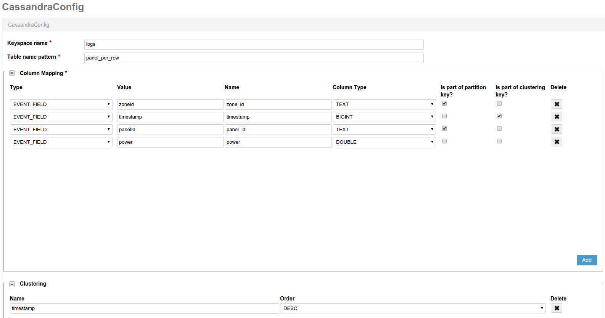

Kaa demo application for Kaa, Cassandra and Zeppelin integration.
============================
This sample Kaa application generates power measurements and uploads it to Cassandra for further processing. It can be used as a prototype for building a production-grade IoT application that measures any kind of data on the endpoints and uploads that data into the selected analytics platform.

This sample application can be also used as a link in the end-to-end IoT solution for data collection and analytics, as will be illustrated further in the instruction. The Kaa application will be used for data collection across the endpoints and dispatching that data to Cassandra for further processing and storage. On the next link of the chain, using Zeppelin notebook integrated with Cassandra, the user will be able to execute analytics queries over collected data and generate insightful charts and reports. 

About Kaa, Cassandra, and Zeppelin

Kaa is an open-source IoT middleware platform for building, managing, and integrating connected products with the Internet of Things. Kaa offers production-ready IoT features that allow developers to create IoT applications for smart products and connected devices in a very condensed timeframe.

The Apache Cassandra database is is an open source distributed database management system designed to handle large amounts of data across many commodity servers, providing high availability with no single point of failure. Linear scalability and proven fault-tolerance on commodity hardware or cloud infrastructure make it the perfect platform for mission-critical data. 

The Apache Zeppelin is a web-based notebook that enables interactive data analytics. You can make beautiful data-driven, interactive and collaborative documents with SQL, Scala and virtually any other language or data-processing-backend.

**Cassandra configuration instruction**

1. If you use the Kaa Sandbox 0.7.4 (or lower), you will have to upgrade Cassandra to the latest version (now is 2.2.4). Please add new repositories from [documentation](http://wiki.apache.org/cassandra/DebianPackaging)

   ```
   $ sudo apt-get update
   $ sudo apt-get upgrade cassandra
   ```

2. Enable to create user defined functions. Change property **enable_user_defined_functions: true** in cassandra.yaml file.

3. Restart Cassandra.

   ```
   $ sudo service cassandra restart
   ```

4. Create keyspace **logs** and functions for our dashboards.

   ```
   $ cqlsh
   cqlsh> CREATE KEYSPACE logs WITH replication = {'class': 'SimpleStrategy', 'replication_factor': 1};
   cqlsh> use logs;
   cqlsh> CREATE OR REPLACE FUNCTION logs.timeFormat(time bigint) RETURNS NULL ON NULL INPUT RETURNS text LANGUAGE java AS $$ return new java.text.SimpleDateFormat("mm:ss").format(new java.util.Date(time));$$;
   cqlsh> CREATE OR REPLACE FUNCTION logs.timeDelta(arg bigint, delta bigint) RETURNS NULL ON NULL INPUT RETURNS bigint LANGUAGE java AS $$ return arg - delta;$$;
   ```

5. Configure the Cassandra log appender via Kaa Admin UI. Create two Cassandra log appenders with different mapping configuration as follows:
  
Panel per row appender:
  

Zone per row appender:
  

**Apache Zeppelin Installation instruction**

1. Download Apache Zeppelin from the official [page]( http://zeppelin.incubator.apache.org/download.html).

   ```
   $ cd /opt
   $ wget http://www.eu.apache.org/dist/incubator/zeppelin/0.5.5-incubating/zeppelin-0.5.5-incubating-bin-all.tgz
   $ tar -xzvf zeppelin-0.5.5-incubating-bin-all.tgz
   $ ln -s /opt/zeppelin-0.5.5-incubating-bin-all /opt/zeppelin
   $ cd ./zeppelin/conf
   $ cp ./zeppelin-env.sh.template  ./zeppelin-env.sh
   ```
2. Change the default Zeppelin port if needed. (In case of the free port 8080, you can skip this step). Add line **export ZEPPELIN_PORT=7080** into the zeppelin-env.sh file.

3. Start Zeppelin.

   ```
   $ sudo /opt/zeppelin/bin/zeppelin-daemon.sh start
   ```

4. Configure the Cassandra Zeppelin interpreter according to your Cassandra cluster configuration.
    More information about Apache Zeppelin you can find on [site](http://zeppelin.incubator.apache.org/)
    On the screens below you can see our custom notebook:

Panel power:
  

Zone power:
  


**Starting Kaa client**
 
To start the Kaa client, execute the following command from CLI:

  ```
  $ git clone git@github.com:kaaproject/kaa-zeppelin-sample.git
  $ cd kaa-zeppelin-sample
  $ mvn clean install exec:java
  ```
