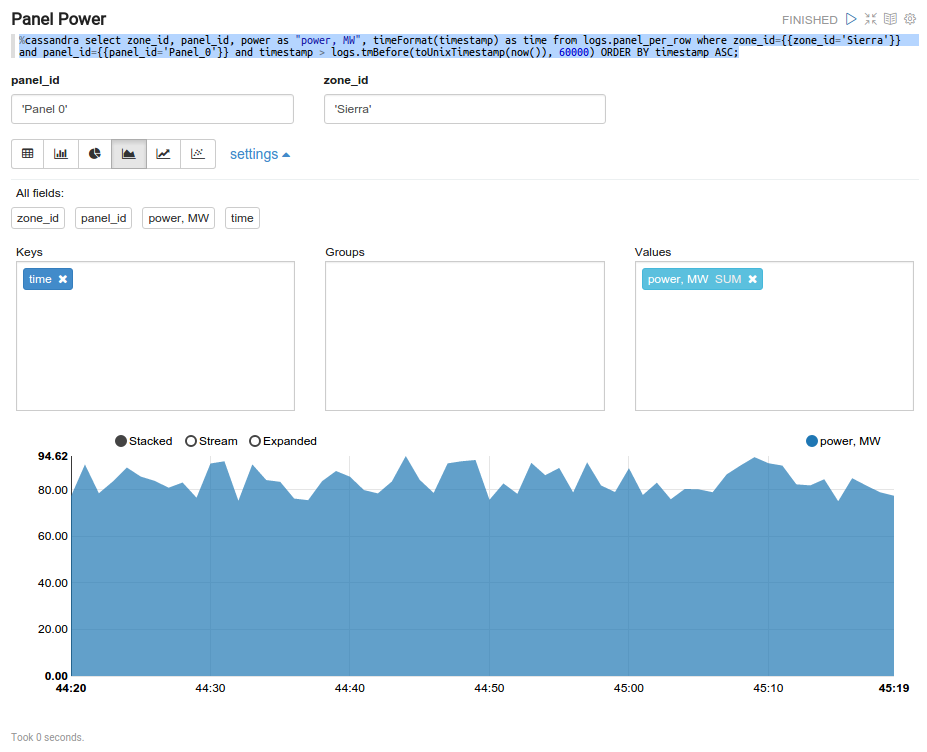

Kaa demo application for Kaa, Cassandra and Zeppelin integration.
============================
This sample Kaa application generates power measurements and uploads it to Cassandra using Kaa.

Kaa is an open-source middleware platform for building, managing, and integrating connected products with the Internet of Everything.

**Cassandra configuration instruction**

1. If you use our sandbox need to upgrade cassandra to the last version(now is 2.2.4). Please add new repositories from [documentations](http://wiki.apache.org/cassandra/DebianPackaging)

   ```
   $ sudo apt-get update
   $ sudo apt-get upgrade cassandra
   ```

2. Enable to create user defined functions. Change property **enable_user_defined_functions: true** in cassandra.yaml file.

3. Restart cassandra

   ```
   $ sudo service cassandra restart
   ```

4. Create keyspace **logs** and functions for our dashboards.

   ```
   $ cqlsh
   cqlsh> CREATE KEYSPACE logs WITH replication = {'class': 'SimpleStrategy', 'replication_factor': 1);
   cqlsh> use logs;
   cqlsh> CREATE OR REPLACE FUNCTION logs.timeFormat(time bigint) RETURNS NULL ON NULL INPUT RETURNS text LANGUAGE java AS $$ return new java.text.SimpleDateFormat("mm:ss").format(new java.util.Date(time));$$;
   cqlsh> CREATE OR REPLACE FUNCTION logs.timeDelta(arg bigint, delta bigint) RETURNS NULL ON NULL INPUT RETURNS bigint LANGUAGE java AS $$ return arg - delta;$$;
   ```

5. Configure Cassandra log appender via Kaa Admin UI. Need  to create two cassandra appenders with different mapping configuration like on screen below:
  
Panel per row appender:
  

Zone per row appender:
  

**Apache Zeppelin Installation instruction**

1. Download Apache Zeppelin from official [page]( http://zeppelin.incubator.apache.org/download.html).

   ```
   $ cd /opt
   $ wget http://www.eu.apache.org/dist/incubator/zeppelin/0.5.5-incubating/zeppelin-0.5.5-incubating-bin-all.tgz
   $ tar -xzvf zeppelin-0.5.5-incubating-bin-all.tgz
   $ ln -s /opt/zeppelin-0.5.5-incubating-bin-all /opt/zeppelin
   $ cd ./zeppelin/conf
   $ cp ./zeppelin-env.sh.template  ./zeppelin-env.sh
   ```
2. Change default zeppelin port if needed.(In case of free port 8080, you can skip this step).Add line **export ZEPPELIN_PORT=7080** into zeppelin-env.sh file.

3. Starting Zeppelin.

   ```
   $ sudo /opt/zeppelin/bin/zeppelin-daemon.sh start
   ```

4. Configure Cassnadra Zeppelin interpreter regarding your cassandra cluster configuration.
    More information about Apache Zeppelin you can find on [site](http://zeppelin.incubator.apache.org/)
    On the screens below you can see our custom notebook:

Panel power:
  

Zone power:
  


**Starting Kaa client**
 
To start Kaa client need to execute next command from CLI

  ```
  $ git clone git@github.com:kaaproject/kaa-zeppelin-sample.git
  $ cd kaa-zeppelin-sample
  $ mvn clean install exec:java
  ```
